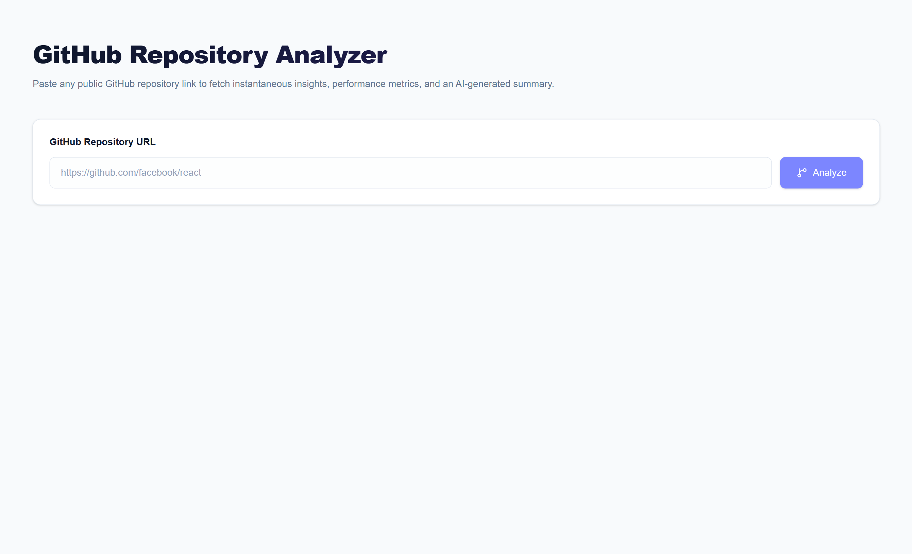
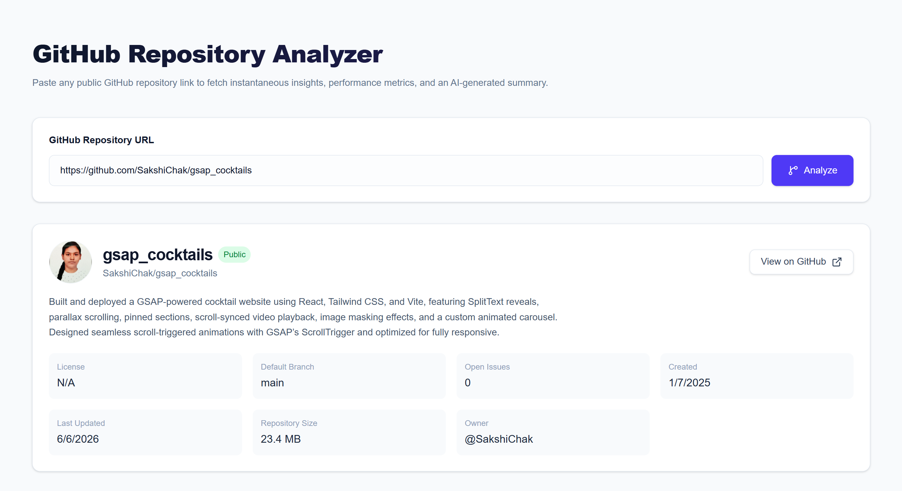
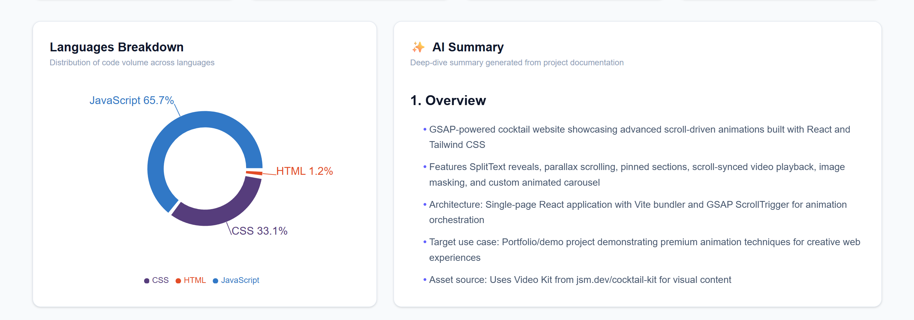
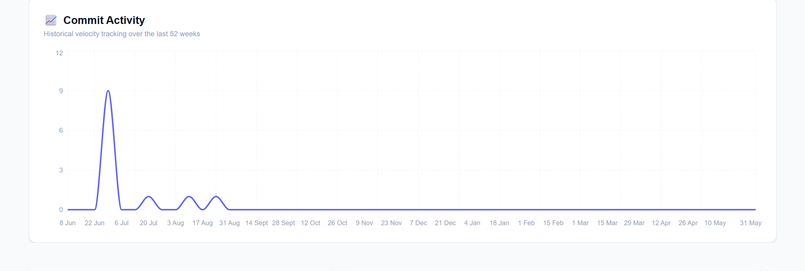

# 🚀 GitHub Repository Analyzer

A full-stack web application that analyzes public GitHub repositories and provides detailed repository insights, visual analytics, health metrics, and AI-generated technical summaries.

Users simply paste a GitHub repository URL and receive comprehensive repository analysis powered by the GitHub API and AI.

---

## ✨ Features

### Repository Analysis

* Analyze any public GitHub repository
* Fetch repository metadata and statistics
* Display repository ownership and license information
* View repository topics and project details

### Metrics Dashboard

* ⭐ Stars count
* 🍴 Forks count
* 👥 Contributors count
* ❤️ Repository Health Score
* 📦 Repository Size
* 🐞 Open Issues

### Visual Analytics

* Language distribution chart
* Weekly commit activity graph

### AI-Powered Repository Report

* README-based project understanding
* Technology stack detection
* Strengths and weaknesses analysis
* Maintenance assessment
* Risk evaluation
* Production readiness recommendation

### Performance Optimizations

* Background AI summary generation
* In-memory caching (24-hour TTL)
* Polling-based summary retrieval
* Fast initial response delivery

---

## 🛠️ Tech Stack

### Frontend

* React 19
* Vite
* Tailwind CSS v4
* Axios
* Recharts
* React Markdown
* Remark GFM
* Lucide React

### Backend

* Node.js
* Express.js
* Axios
* OpenAI SDK

### APIs & Services

* GitHub REST API
* NVIDIA Inference API
* MiniMax M2.7 Model

---

## 🏗️ System Architecture

```text
User
 │
 ▼
React Frontend
 │
 ▼
Express Backend API
 │
 ├── GitHub REST API
 │      ├── Repository Metadata
 │      ├── Contributors
 │      ├── Languages
 │      ├── README Content
 │      └── Commit Activity
 │
 ├── Health Score Calculator
 │
 └── AI Summary Generator
         │
         ▼
 NVIDIA + MiniMax M2.7
```

---

## 📂 Project Structure

### Frontend

```text
frontend/
│
├── src/
│   ├── components/
│   │   ├── RepoForm.jsx
│   │   ├── RepoDetails.jsx
│   │   ├── MetricsCard.jsx
│   │   ├── LanguageChart.jsx
│   │   ├── CommitChart.jsx
│   │   └── SummaryCard.jsx
│   │
│   ├── pages/
│   │   └── Home.jsx
│   │
│   ├── services/
│   │   └── api.js
│   │
│   ├── App.jsx
│   └── main.jsx
│
└── package.json
```

### Backend

```text
backend/
│
├── src/
│   ├── config/
│   ├── controllers/
│   ├── routes/
│   ├── services/
│   ├── utils/
│   ├── app.js
│   └── server.js
│
├── package.json
└── .env
```

---

## 🔌 API Endpoints

### Analyze Repository

```http
POST /api/github/analyze
```

#### Request

```json
{
  "repoUrl": "https://github.com/facebook/react"
}
```

#### Response

```json
{
  "repository": {},
  "contributors": 0,
  "languages": {},
  "healthScore": 0,
  "summary": null,
  "commitActivity": [],
  "repoKey": "",
  "summaryReady": false
}
```

---

### Get AI Summary

```http
GET /api/github/summary/:repoKey
```

Returns the generated AI summary when available.

---

## ❤️ Repository Health Score

The health score provides an overall assessment of repository quality and maintenance status.

The score is calculated using:

- Community popularity (Stars)
- Community adoption (Forks)
- Contributor participation
- Open issue count
- Commit activity over time
- Repository update frequency

Higher scores generally indicate actively maintained, well-adopted, and healthier repositories.

Score Range: 0–100

---

## 🤖 AI Summary Workflow

1. User submits a GitHub repository URL
2. Backend fetches repository data from GitHub API
3. README content is extracted
4. Health score is calculated
5. Initial metrics are returned immediately
6. AI summary generation starts in the background
7. Generated summary is cached for 24 hours
8. Frontend polls the backend until the summary is available
9. Markdown report is rendered in the UI

---

## ⚙️ Installation

### Clone Repository

```bash
git clone <repository-url>
cd github-repository-analyzer
```

---

### Backend Setup

```bash
cd backend

npm install

npm run dev
```

Create a `.env` file:

```env
PORT=5000

GITHUB_TOKEN=your_github_token

NVIDIA_API_KEY=your_nvidia_api_key
```

---

### Frontend Setup

```bash
cd frontend

npm install

npm run dev
```

---

## 🌐 Environment Variables

| Variable       | Description                      |
| -------------- | -------------------------------- |
| PORT           | Backend server port              |
| GITHUB_TOKEN   | GitHub Personal Access Token     |
| NVIDIA_API_KEY | NVIDIA API Key for MiniMax model |

---

---

## 📸 Screenshots

### Home Page



### Repository Metrics Dashboard



### AI Generated Report



### Commit Activity Graph



---

## 🚀 Deployment

### Frontend

Deploy using Vercel.

### Backend

Deploy using Vercel.

---

## 👩‍💻 Author

**Sakshi Chak**

